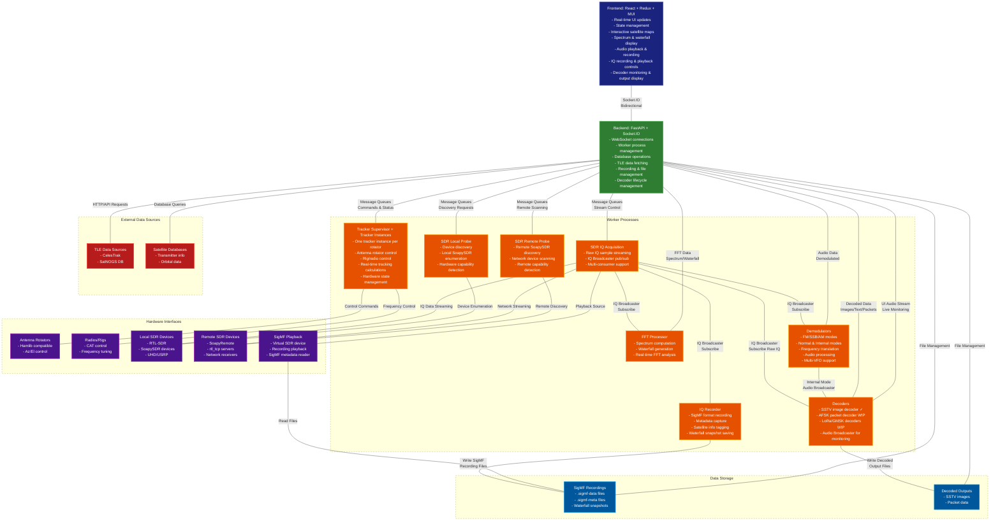
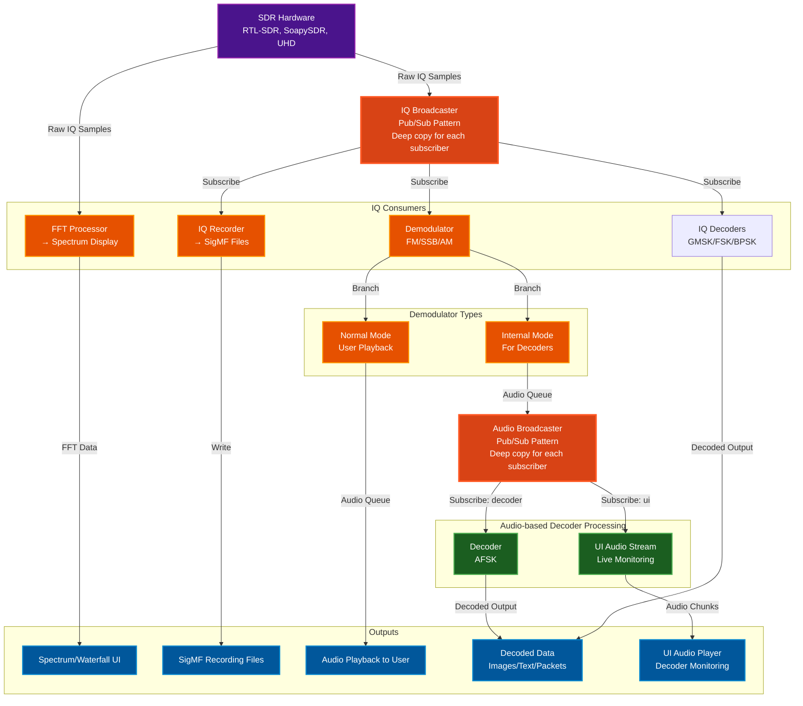

# DynamiX-Labs Ground Station Suite

[](https://github.com/sgoudelis/ground-station/actions/workflows/tests.yml) [](https://www.gnu.org/licenses/gpl-3.0) [](https://github.com/sgoudelis/ground-station/actions/workflows/release-from-images.yml) [](https://github.com/sgoudelis/ground-station/releases/latest)  

**DynamiX-Labs Ground Station is an end-to-end, high-performance, and fully modular software suite for autonomous satellite tracking, real-time digital signal processing (DSP), and telemetry decoding.** It offers a unified web-based command center that coordinates hardware equipment, dynamically compensates for Doppler shifts, and processes raw radio signals down to clean data packets.

---

### Who is this project for?

Designed for a wide range of aerospace, academic, and enthusiast applications:
*   **Students & Educators:** Set up a highly capable university or school ground station using low-cost hardware (e.g., RTL-SDR and a simple dipole or Yagi).
*   **CubeSat & SmallSat Teams:** Deploy a fully customizable telemetry deframer and packet parser that handles industry-standard protocols without complex proprietary toolchains.
*   **Amateur Radio Operators (Hams):** Operate motorized rotator mounts and multi-band radio rigs with precise Doppler-corrected frequency tuning and automated live decoding.
*   **RF & DSP Researchers:** Rapidly prototype and evaluate signal processing pipelines, VFO demodulators, and decoders using a robust, decoupled publish/subscribe architecture.

### Core Multi-Layer Ecosystem Architecture

The suite is engineered around the standard **DynamiX-Labs L0-L4 Multi-Layer Architecture** to decouple hardware, tracking, digital signal processing (DSP), and telemetry decoding:

*   **L0: RF Digitization & Benchmarking Layer (`SDR-Hardware-Benchmark`):** Digitizes raw radio waves into Complex64 IQ sample streams, profiling hardware throughput, latency, and sample drops.
*   **L1: Autonomous Pass Engine (`Doppler-Auto-Tracker`):** Calculates orbital paths using SGP4 propagators, controls physical antenna rotators via Hamlib, and publishes real-time Doppler shift offsets.
*   **L2: GPU-Accelerated DSP (`SatSDR-Universal`):** Translates frequencies, operates multi-VFO baseband demodulators (FM/SSB/AM), and performs symbol synchronizations.
*   **L3: Telemetry, AI & Security (`CubeSat-Telemetry-Decoder`):** Extracts packets from sync-word matches (AX.25/CSP), decrypts protected communications (XTEA), and isolates telemetry sensor anomalies.
*   **L4: Live Streaming & Control (WebSockets + React Dashboard):** Streams waterfall canvases, decoded frames, and baseband audio chunks via asynchronous WebSockets to a unified UI control center.

---


## Screenshots

<div align="center">

### Single-Target Tracking Console


*Dedicated tracking view for a single satellite showing Leaflet map with ground track, real-time Az/El/Alt/Vel telemetry, position data, and rotator control panel with polar gauge*

---

### Satellite Pass Schedule & Overview


*Real-time satellite group overview with visibility status, elevation tracking, pass progress bars, and a rolling timeline of upcoming passes for the next 4 hours*

---

### Multi-Target Tracking with Rotator & Rig Control


*Multi-target tracking console with three simultaneous targets (ISS, YUBILEINY, OSCAR 7), Hamlib rotator and FT-857D rig control with live Doppler-corrected VFO frequencies, and a 24-hour pass elevation timeline*

---

### Waterfall & Spectrum — Live GMSK Packet Decoding


*Live waterfall spectrum display at 436 MHz capturing GMSK satellite downlinks, dual VFO markers with Doppler-corrected frequencies, AX.25 packet table with decoded frames, and configurable FFT/IQ recording settings*

---

### DSP Pipeline Topology & Performance Monitor


*React Flow visualization of the signal processing pipeline: SDR workers → IQ Broadcasters → FFT Processors / IQ Recorders → WebAudio Streamer → Browser, with per-node CPU, memory, queue health, and throughput metrics*

---

</div>

## Key Features

*   **Real-time Satellite Tracking:** Track hundreds of satellites with high-precision orbital models. TLE data is automatically updated from CelesTrak and SatNOGS.
*   **Multi-Target Tracking Fleet:** Run multiple target trackers at the same time, each with its own rig/rotator control path, so you can operate several target-hardware chains in parallel.
*   **Automated Antenna Rotator Control:** Interface with popular antenna rotators to automatically track satellites as they pass overhead.
*   **Rig Control (Hamlib):** Control Hamlib-compatible rigs with Doppler correction during satellite passes.
*   **SDR Integration:** Stream and record live radio signals from a wide range of SDR devices, including RTL-SDR, SoapySDR, and UHD/USRP radios.
*   **IQ Recording & Playback:** Record raw IQ data in SigMF format with complete metadata (center frequency, sample rate, satellite info) and play back recordings through a virtual SDR device for analysis and debugging.
*   **Data Decoding & Benchmarking:** Decode SSTV, FSK, GFSK, GMSK, and BPSK with AX25 USP Geoscan framing. Compare decoding and demodulation efficiency by benchmarking physical SDR hardware under load using the [SDR-Hardware-Benchmark](https://github.com/DynamiX-Labs/SDR-Hardware-Benchmark) suite. This lets you profile sample drop ratios, processor latency, and SNR across devices like RTL-SDR, HackRF, ADALM-PLUTO, and USRP.
*   **AI-Powered Transcription:** Real-time speech-to-text for demodulated audio via Gemini Live or Deepgram. Privacy-conscious and user-keyed, with optional translation and file output to `backend/data/transcriptions/`.
*   **Scheduled Observations:** Define detailed observation tasks that automatically listen, decode, transcribe, and record audio and IQ during satellite passes without manual intervention.
*   **SatDump Integration:** Decode weather satellite images from METEOR-M2 (LRPT and HRPT) via SatDump, coupled with automated observations.
*   **Performance Monitoring:** Real-time visualization of the signal processing pipeline showing data flow between components (SDR → FFT → Demodulator → Decoder → Browser), queue health monitoring, throughput rates, and component statistics to diagnose bottlenecks and optimize performance.
*   **Responsive Web Interface:** A modern, responsive, and intuitive web interface built with Material-UI that adapts seamlessly to desktop, tablet, and mobile devices, allowing you to control all aspects of the ground station from anywhere on your network. Works great on a tablet and cell.

## Scheduled Observations & Automated Pass Recording

Ground Station includes a comprehensive automated observation system that can schedule and execute satellite passes without user intervention:

*   **Monitored Satellites:** Define satellite monitoring templates with hardware configurations, signal parameters, and task definitions. The system automatically generates scheduled observations for all qualifying passes.
*   **Automated Pass Scheduling:** Automatically calculate and schedule upcoming satellite passes based on configurable criteria (minimum elevation, lookahead window). The scheduler uses APScheduler to trigger observations at AOS (Acquisition of Signal) and stop at LOS (Loss of Signal).
*   **Flexible Task Composition:** Each observation can include multiple concurrent tasks: IQ recording (SigMF format), audio recording (WAV), protocol decoding (AFSK, GMSK, SSTV), and optional AI transcription.
*   **Hardware Orchestration:** Automatically controls SDR devices, antenna rotators (with satellite tracking), and rigs (with Doppler correction) during scheduled observations.
*   **Live Observation Capability:** Users can observe any automated pass in real-time through the web interface - view the spectrum waterfall, listen to demodulated audio, and watch live decoder output. When using the same SDR as an automated observation, users can monitor without interference, but be aware that changing the SDR's center frequency or bandwidth will affect the ongoing observation.
*   **Multi-SDR Observing:** Automated observations can run on one SDR while additional SDRs record, decode, and listen to the same pass in parallel.
*   **Status Management:** Real-time observation status tracking (scheduled, running, completed, failed, cancelled, missed) with automatic cleanup of old completed observations.
*   **Session Management:** Automated observations run in isolated internal VFO sessions (namespace: "internal:<observation_id>"). When using different SDRs, user sessions and automated observations operate completely independently without any interference.

## Engineering Roadmap & Future Capabilities

We are actively developing and expanding the DynamiX-Labs Ground Station Suite to integrate next-generation aerospace telemetry and DSP capabilities. The following milestones represent our active research and development directions:

### 1. Advanced Digital Signal Processing (DSP)
*   **GPU-Accelerated FFT Engine:** Transition FFT processing from CPU-bound threads to highly parallel CUDA/OpenCL kernels, enabling real-time wideband spectrum analysis up to 50 MHz bandwidth.
*   **Adaptive Noise Cancellation:** Implement active LMS/RLS adaptive filtering algorithms to suppress local RF noise and out-of-band interference dynamically during passes.
*   **Automatic Modulation Classification (AMC):** Integrate a lightweight CNN classifier to automatically identify modulation formats (e.g., BPSK, QPSK, GMSK) of active signal bursts.

### 2. High-Performance Protocol Decoders
*   **Advanced Telemetry Decoders:**
    *   **CCSDS Demodulator and Deframer:** Fully compliant CCSDS telemetry processor supporting Reed-Solomon and Viterbi FEC decoding.
    *   **LoRa PHY Decoder:** High-sensitivity LoRa receiver for modern LEO IoT pocketqubes and pico-satellites.
    *   **NOAA APT/HRPT Processing:** Real-time decoding and false-color synthesis for weather imagery satellites.
*   **Multi-Protocol Deframing & Demultiplexing:** Support multi-destination frame routing based on CSP (CubeSat Space Protocol) headers.

### 3. Subsystem Integration and Hardware Support
*   **Expanded Rotator Protocols:** Direct support for advanced azimuth/elevation rotator controllers (SPID, GS-232B, and custom micro-controller systems).
*   **High-Speed USRP Integration:** Support for 10GbE network streaming for UHD/USRP devices, ensuring sample integrity and zero-copy performance at high sample rates.

### 4. Telemetry Intelligence and Security
*   **Machine Learning Anomaly Detection:** Deploy a local real-time isolation forest and LSTM autoencoder telemetry anomaly model to identify payload/sensor degradation during observation passes.
*   **End-to-End Cryptography:** Secure command-and-control links with premium XTEA and AES-GCM decryption blocks.


## Architectural Breakdown (In Word)

The DynamiX-Labs architecture operates across five high-performance layers:

1.  **L0: RF Frontend & Digitization (SDR-Hardware-Benchmark):** 
    At the bottom sits the physical hardware interface. The incoming RF signal captured by the directional Yagi/Helical antenna arrays is amplified by LNAs and digitized into raw Complex64 IQ samples by SDR transceivers (RTL-SDR, HackRF, ADALM-PLUTO, or USRP). This layer integrates the **SDR-Hardware-Benchmark** utility to measure memory bus performance, profile CPU/GPU constraints, track sample drops, and run zero-copy transfer validation.
2.  **L1: Autonomous Pass Engine (Doppler-Auto-Tracker):**
    Positioned closest to the physical gear, this tracker automatically polls orbital parameters (TLE datasets) from external repositories like CelesTrak. It drives the SGP4 orbital propagator to calculate real-time satellite positions, physically steering Az/El antenna rotators via Hamlib protocols. Simultaneously, it computes the expected Doppler shift caused by satellite velocity and publishes real-time frequency tuning offsets (Hz) to an internal Python queue.
3.  **L2: GPU-Accelerated DSP (SatSDR-Universal):**
    Powered by the **SatSDR-Universal** engine, this layer consumes raw IQ streams from L0. It reads dynamic Doppler compensation tuning corrections directly from the L1 frequency correction queue, shifting the SDR VFO markers in real-time. SatSDR-Universal implements a highly efficient multi-VFO channelizer, spectral peak detection (using GPU-accelerated Welch PSD estimators), and baseband demodulation. Synced data passes through timing error detectors (Gardner TED) and Costas loops to reconstruct clean bits.
4.  **L3: Telemetry, AI, & Security (CubeSat-Telemetry-Decoder):**
    Responsible for decoding data streams into human-readable telemetry. The **CubeSat-Telemetry-Decoder** extracts frames from synched bitstreams using synchronization word matching (AX.25/CCSDS/KISS/CSP). It decrypts protected communications (XTEA decryption algorithms) and parses telemetry payloads. Parsed telemetry vectors are monitored in real-time using a local Isolation Forest machine learning model to flag sensor anomalies.
5.  **L4: WebSocket Streaming & Unified Dashboard:**
    Coordination and UI layer. An asynchronous FastAPI server receives parsed data packets, FFT spectral metrics, and demodulated audio buffers from the backend workers. These data blocks are packed into high-throughput binary frames (MessagePack) and pushed via WebSockets to a responsive React/Material-UI frontend dashboard for live monitoring and administrative control.

---

### Low-Level Service Breakdown

The Ground Station application is composed of a frontend, a backend, and a set of worker processes.

### High-Level System Architecture



### Signal Processing Data Flow

This diagram shows how radio signals flow through the system from SDR hardware to decoders and UI:



#### Key Concepts

**IQ Broadcaster (Pub/Sub Pattern):**
- SDR produces raw IQ samples at high rate
- IQBroadcaster distributes to multiple consumers simultaneously
- Each subscriber gets independent queue with deep-copied samples
- Slow consumers: messages dropped rather than blocking producer
- Supports: FFT processor, demodulators, IQ recorder, decoders (LoRa/GMSK)

**Audio Broadcaster (Decoder Pattern):**
- Only used for internal demodulators feeding decoders
- Distributes demodulated audio to:
  - **Decoder subscriber:** SSTV/AFSK decoder processing
  - **UI subscriber:** Live audio monitoring in browser
- Statistics tracking: delivered/dropped message counts per subscriber
- Graceful slow consumer handling

**Chain Processing Example (SSTV):**
1. SDR → IQBroadcaster → Internal FM Demodulator (SSTV)
2. FM Demodulator → AudioBroadcaster input queue
3. AudioBroadcaster → Decoder subscriber → SSTV Decoder → Image output
4. AudioBroadcaster → UI subscriber → Browser audio player

**Why Broadcasters?**
- **Decoupling:** Producers don't know about consumers
- **Scalability:** Add consumers without modifying producers
- **Monitoring:** Per-subscriber statistics and health monitoring
- **Reliability:** Slow consumers don't block fast producers

*   **Frontend:** The frontend is a single-page application built with React, Redux Toolkit, and Material-UI. It communicates with the backend using a socket.io connection for real-time updates, including decoded data display and live audio monitoring.
*   **Backend:** The backend is a Python application built with FastAPI. It provides a REST API and a socket.io interface for the frontend. It manages worker processes, decoder lifecycle, and coordinates the pub/sub architecture for signal distribution.
*   **Workers:** The worker processes are responsible for the heavy lifting. They perform tasks such as satellite tracking, SDR streaming, signal demodulation, data decoding (SSTV implemented, AFSK/LoRa in development), and antenna control. Workers use IQ Broadcaster and Audio Broadcaster for efficient multi-consumer signal distribution.

## Third-Party Libraries & Technologies

### Backend

*   **[FastAPI](https://fastapi.tiangolo.com/):** A modern, fast (high-performance), web framework for building APIs with Python 3.7+ based on standard Python type hints.
*   **[SQLAlchemy](https://www.sqlalchemy.org/):** The Python SQL Toolkit and Object Relational Mapper that gives application developers the full power and flexibility of SQL.
*   **[Skyfield](https://rhodesmill.org/skyfield/):** A modern astronomy library for Python that computes positions for the stars, planets, and satellites in orbit around the Earth.
*   **[SGP4](https://pypi.org/project/sgp4/):** A Python implementation of the SGP4 satellite propagation model.
*   **[Socket.IO](https://python-socketio.readthedocs.io/en/latest/):** A library for real-time, bidirectional, event-based communication.
*   **[pyrtlsdr](https://pypi.org/project/pyrtlsdr/):** A Python wrapper for the RTL-SDR library.
*   **[SoapySDR](https://pypi.org/project/SoapySDR/):** A vendor and platform neutral SDR support library.
*   **[SatDump](https://github.com/SatDump/SatDump):** Satellite decoder suite used for weather image decoding workflows.
*   **[gr-satellites](https://github.com/daniestevez/gr-satellites):** GNU Radio out-of-tree modules for satellite communications decoding.

### Frontend

*   **[React](https://reactjs.org/):** A JavaScript library for building user interfaces.
*   **[Redux Toolkit](https://redux-toolkit.js.org/):** The official, opinionated, batteries-included toolset for efficient Redux development.
*   **[Material-UI](https://mui.com/):** A popular React UI framework with a comprehensive suite of UI tools.
*   **[Vite](https://vitejs.dev/):** A build tool that aims to provide a faster and leaner development experience for modern web projects.
*   **[Socket.IO Client](https://socket.io/docs/v4/client-api/):** The client-side library for Socket.IO.
*   **[Leaflet](https://leafletjs.com/):** An open-source JavaScript library for mobile-friendly interactive maps.
*   **[satellite.js](https://github.com/shashwatak/satellite-js):** A JavaScript library to propagate satellite orbits.

## SDR Device Support

Dedicated worker processes provide IQ acquisition, FFT processing, and demodulation support for multiple receiver families:

*   **RTL-SDR** (USB or `rtl_tcp`) workers
*   **SoapySDR** devices locally or through SoapyRemote: RTL-SDR, Airspy, AirspyHF+, HackRF, HydraSDR, LimeSDR, PlutoSDR, UHD/USRP, and SDRplay (RSP series)
*   **UHD/USRP** radios via a UHD worker
*   **Need another SoapySDR device?** Open a GitHub issue and request support.

The SDR architecture uses a pub/sub pattern (IQ Broadcaster) to separate IQ acquisition from signal processing:
*   **IQ Acquisition Workers** stream raw samples to **IQ Broadcaster**
*   **IQ Broadcaster** distributes to multiple subscribers independently:
    *   **FFT Processor** for spectrum/waterfall display
    *   **Demodulators** (FM/SSB/AM) for audio output in normal and internal modes
    *   **IQ Recorder** for SigMF format file capture
*   **Raw IQ Decoders** (BPSK, GMSK) that bypass demodulation
*   **Audio Broadcaster** distributes demodulated audio from internal demodulators to:
*   **Data Decoders** (AFSK) for signal decoding
    *   **UI Audio Stream** for live monitoring in browser
       
## IQ Recording & Playback

Ground Station includes comprehensive IQ recording and playback capabilities using the [SigMF (Signal Metadata Format)](https://github.com/gnuradio/SigMF) standard:

### Recording Features
*   **SigMF Format:** Records IQ data as `.sigmf-data` files with accompanying `.sigmf-meta` JSON metadata
*   **Automatic Metadata:** Captures center frequency, sample rate, timestamp, and recording duration
*   **Satellite Tracking:** Automatically tags recordings with target satellite name and NORAD ID
*   **Waterfall Snapshots:** Saves PNG snapshots of the waterfall display alongside recordings
*   **Multi-segment Support:** Handles parameter changes (frequency, sample rate) as separate capture segments
*   **Real-time Monitoring:** Live duration counter and visual recording indicator in the UI

### Playback Features
*   **Virtual SDR Device:** Recordings appear as "SigMF Playback" SDR in the device list
*   **Full Processing Pipeline:** Playback supports FFT display, demodulation, and all signal processing
*   **Live-equivalent Decoding:** During playback, demodulators and decoders run exactly as they do with live SDR input
*   **Recording Browser:** Sortable list of recordings with metadata preview (sample rate, duration, timestamp)
*   **Seamless Integration:** Switch between live SDR and playback without changing workflows


## Getting Started

For development setup, build steps, and testing, see `DEVELOPMENT.md`.

## Application Configuration

Ground Station backend runtime options are stored in `backend/data/configs/app_config.json` and are editable in the UI at `Settings -> Settings`.

Configuration precedence is:

1. CLI flags (highest priority)
2. `app_config.json`
3. built-in defaults (lowest priority)

The UI also exposes when a value is currently CLI-overridden and whether a change is hot-applied or restart-required.

`/settings/preferences` is kept as a compatibility route and is now rendered as a tab inside the unified Settings page.

## Docker

### Building from Source

The repository includes a multi-stage `Dockerfile` (located inside the `docker/` directory) that builds the React frontend and a Python environment with SDR libraries.

To build the image manually:

```bash
docker build -t ground-station -f docker/Dockerfile .

# Option 1: Standard bridge mode (works for local SDRs)
docker run --rm -p 7000:7000 --device /dev/bus/usb ground-station

# Option 2: Host networking (required for SoapySDR remote server discovery via mDNS)
docker run --rm --network host --device /dev/bus/usb ground-station
```

### Running with Docker Compose

For a much easier setup, you can use the newly created `docker-compose.yml` file. This is configured to build and run the ground station seamlessly:

```bash
# Build and start the container in the background
docker compose up -d --build

# Follow the container logs
docker compose logs -f

# Stop the container
docker compose down
```

### Using Pre-built Docker Images

Pre-built multi-architecture Docker images are available for each release. For detailed instructions on using a specific release, see the [Releases page](https://github.com/sgoudelis/ground-station/releases).

### Pull the image

```bash
# Latest release tag (recommended)
docker pull ghcr.io/sgoudelis/ground-station:<version>

# Or pull architecture-specific tags directly
docker pull ghcr.io/sgoudelis/ground-station:<version>-amd64
docker pull ghcr.io/sgoudelis/ground-station:<version>-arm64
```

### Run the container

**Option 1: With SoapySDR Remote Server Discovery (Recommended)**

Uses host networking to enable automatic mDNS discovery of SoapySDR remote servers:

```bash
# AMD64
docker run -d \
  --platform linux/amd64 \
  --network host \
  --name ground-station \
  --restart unless-stopped \
  --device=/dev/bus/usb \
  --privileged \
  -v /path/to/data:/app/backend/data \
  -e GS_ENVIRONMENT=production \
  -e GR_BUFFER_TYPE=vmcirc_mmap_tmpfile \
  ghcr.io/sgoudelis/ground-station:<version>

# ARM64 (Raspberry Pi, etc)
docker run -d \
  --platform linux/arm64 \
  --network host \
  --name ground-station \
  --restart unless-stopped \
  -v /dev:/dev \
  --privileged \
  -v /path/to/data:/app/backend/data \
  -e GS_ENVIRONMENT=production \
  -e GR_BUFFER_TYPE=vmcirc_mmap_tmpfile \
  ghcr.io/sgoudelis/ground-station:<version>
```

**Option 2: Standard Bridge Mode (No SoapySDR Remote Discovery)**

Uses standard bridge networking with port mapping:

```bash
# AMD64
docker run -d \
  --platform linux/amd64 \
  -p 7000:7000 \
  --name ground-station \
  --restart unless-stopped \
  --device=/dev/bus/usb \
  --privileged \
  -v /path/to/data:/app/backend/data \
  -e GS_ENVIRONMENT=production \
  -e GR_BUFFER_TYPE=vmcirc_mmap_tmpfile \
  ghcr.io/sgoudelis/ground-station:<version>

# ARM64 (Raspberry Pi, etc)
docker run -d \
  --platform linux/arm64 \
  -p 7000:7000 \
  --name ground-station \
  --restart unless-stopped \
  -v /dev:/dev \
  --privileged \
  -v /path/to/data:/app/backend/data \
  -e GS_ENVIRONMENT=production \
  -e GR_BUFFER_TYPE=vmcirc_mmap_tmpfile \
  ghcr.io/sgoudelis/ground-station:<version>
```

**Important Notes:**
- Replace `/path/to/data` with your desired data directory path
- Option 1 (host networking) is required for automatic discovery of SoapySDR remote servers via mDNS
- Option 2 works for local SDRs and all other features
- For Raspberry Pi hardware, only the Raspberry Pi 5 is recommended
- For ARM64, using `-v /dev:/dev` ensures all USB devices are accessible
- Access the web interface at `http://<YOUR_HOST>:7000`

## Contributing

We welcome contributions! Please see the [CONTRIBUTING.md](CONTRIBUTING.md) file for details on how to get started.

## Acknowledgments

This project uses the SatNOGS API for transmitter information.

## License

This project is licensed under the GNU GPL v3. See the [LICENSE](LICENSE) file for details.
